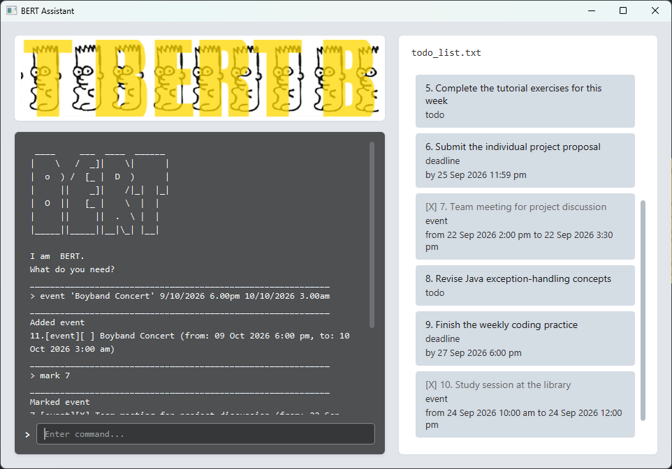

# BERT Assistant User Guide

**BERT Assistant** is a friendly chatbot for keeping track of todos, deadlines, and events. Type a command in the chat box and press Enter. Your tasks are saved automatically.



> **Tip:** Put text containing spaces in single quotes, for example `'buy groceries'`.

## Quick start

Add a todo, then view it:

```
todo 'buy groceries'
list
```

Each task has a number in the list. Use that number to manage it.

## Commands

### Add tasks

```
todo 'read Chapter 3'
deadline 'submit proposal' 2026-09-25 23:59
event 'team meeting' 2026-09-22 14:00 2026-09-22 15:30
```

Dates and times accept convenient formats. For example, use `2026-09-19 12:16` or the more natural `19/9/2026 12.16pm`. A deadline or event without a time starts or ends at midnight.

### View and find

```
list
find 'meeting'
```

`list` shows every task. `find` shows tasks whose descriptions contain the keyword.

### Mark, unmark, and delete

```
mark 1
unmark 1
delete 1
```

Replace `1` with the task number shown by `list`. Marking a task records it as complete; deleting it removes it permanently.

### Exit

```
bye
```

You can also use the shorter command names: `t`, `d`, `e`, `f`, `m`, `um`, `r`, and `q`.
